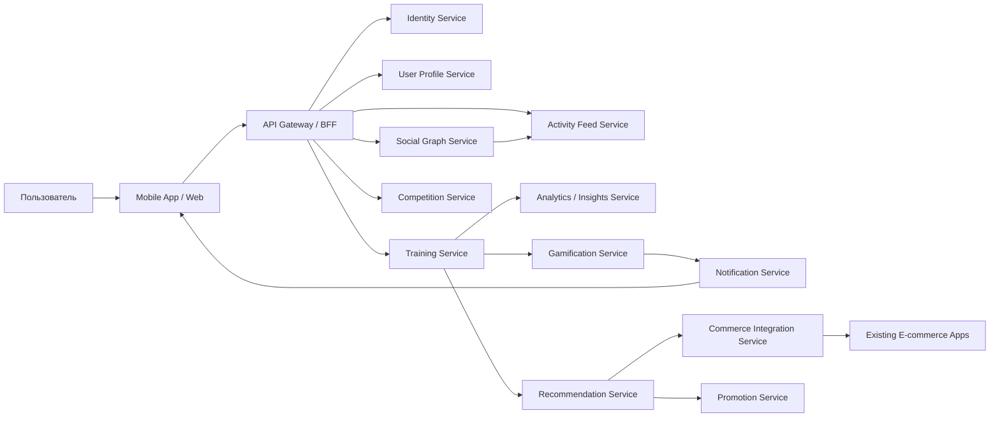
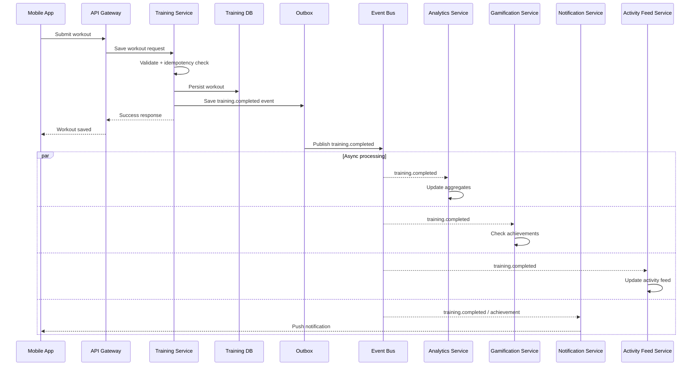
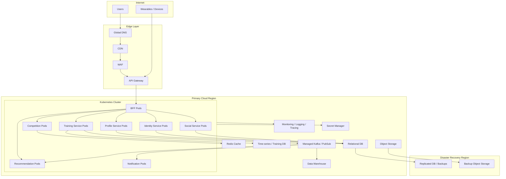
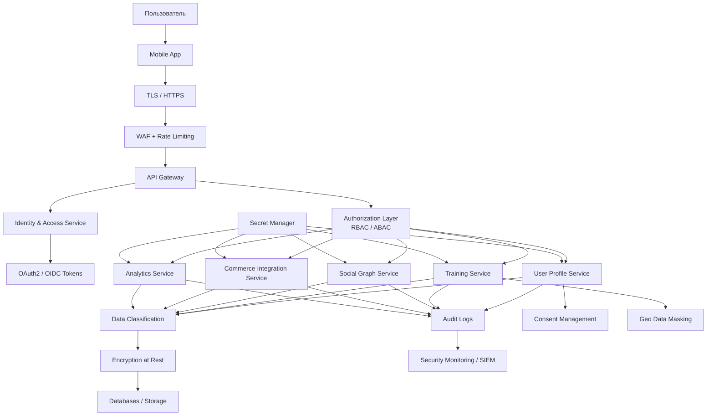

# 14. Основные архитектурные представления

---

# 14.1. Функциональное представление

Функциональное представление показывает, какие бизнес-возможности реализует система.

## Основные функциональные домены

| Домен | Назначение |
|---|---|
| Identity | Аутентификация и доступ |
| User Profile | Профиль, настройки, инвентарь |
| Training | Тренировки и активность |
| Device Integration | Подключение внешних устройств |
| Social | Друзья, группы, связи |
| Activity Feed | Лента активности |
| Gamification | Достижения, челленджи |
| Competition | Массовые соревнования |
| Recommendation | Рекомендации |
| Notification | Уведомления |
| Promotion | Промо и новости |
| Commerce | Интеграция с продажами |

## Основной функциональный поток
Тренировка является центральным событием системы:

```text
Workout completed
      ↓
Training Service
      ↓
Event Bus
      ↓
Analytics / Gamification / Notification / Recommendation
```



---

# 14.2. Информационное представление

Информационное представление описывает основные данные системы.

## Основные сущности

| Сущность | Описание |
|---|---|
| User | Пользователь |
| Profile | Спортивный профиль |
| Workout | Тренировка |
| WorkoutMetrics | Метрики тренировки |
| Device | Устройство |
| InventoryItem | Инвентарь |
| Group | Социальная группа |
| Challenge | Челлендж |
| Competition | Соревнование |
| Achievement | Достижение |
| Promotion | Промоакция |
| Recommendation | Рекомендация |

## Классы данных по чувствительности

| Класс | Примеры | Защита |
|---|---|---|
| Public | публичные достижения | базовая |
| Personal | имя, регион | доступ по ролям |
| Sensitive | здоровье, маршруты | шифрование, аудит |
| Commercial | промо, заказы | контроль доступа |
| Operational | логи, метрики | retention policy |

## Подход к хранению
- транзакционные данные — relational DB;
- телеметрия — time-series / wide-column;
- события — event log;
- аналитика — warehouse;
- кэш — Redis;
- социальные связи — graph-like model.


---

# 14.3. Представление многозадачности / concurrency

Это представление показывает, как система справляется с параллельными запросами, асинхронными процессами и пиковыми нагрузками.

## Основные источники параллелизма
- одновременная запись тренировок;
- массовые соревнования;
- рассылка уведомлений;
- обновление лент активности;
- пересчёт достижений;
- загрузка данных с устройств.

## Основные паттерны

### 1. Idempotency
Повторная отправка тренировки не должна создавать дубликат.

### 2. Outbox Pattern
Если сервис сохранил тренировку, событие о ней не должно потеряться.

### 3. Retry + DLQ
Ошибочные события не теряются, а попадают в отдельную очередь.

### 4. CQRS для тяжёлых read-сценариев
Leaderboard и аналитика читаются из подготовленных моделей.

### 5. Backpressure
При пиках система ограничивает скорость обработки, чтобы не упасть полностью.


---

# 14.4. Инфраструктурное представление

## Основные элементы
- Kubernetes clusters;
- managed databases;
- Kafka/PubSub;
- CDN;
- API Gateway;
- object storage;
- monitoring stack;
- secret manager.

## Среды
- dev;
- test;
- staging;
- production.

## Развёртывание
- CI/CD pipeline;
- blue-green или canary deployments;
- infrastructure as code;
- automated rollback.

## Multi-region подход
Для MVP достаточно одного основного региона и disaster recovery.  
Для глобального масштаба — несколько регионов с локализацией данных.


---

# 14.5. Представление безопасности

## Основные угрозы
- кража аккаунта;
- утечка маршрутов;
- несанкционированный доступ к данным здоровья;
- злоупотребление социальными функциями;
- компрометация API;
- утечка токенов устройств.

## Меры безопасности
- OAuth2/OIDC;
- MFA для чувствительных операций;
- TLS everywhere;
- encryption at rest;
- RBAC/ABAC;
- audit logs;
- secrets management;
- WAF;
- rate limiting;
- privacy settings;
- consent management.

## Privacy by default
По умолчанию чувствительные данные не должны быть публичными:
- точные маршруты скрыты;
- активность видна только выбранной аудитории;
- текущая геолокация не раскрывается без явного согласия.


