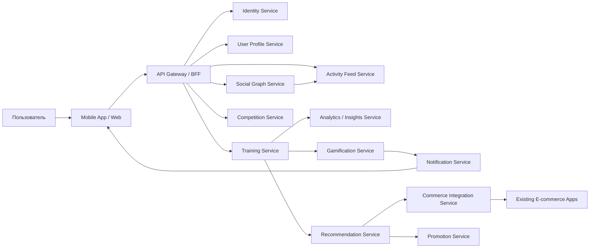
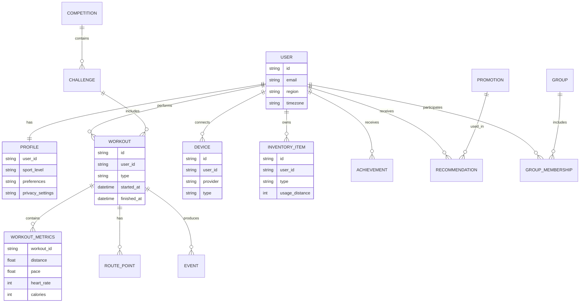
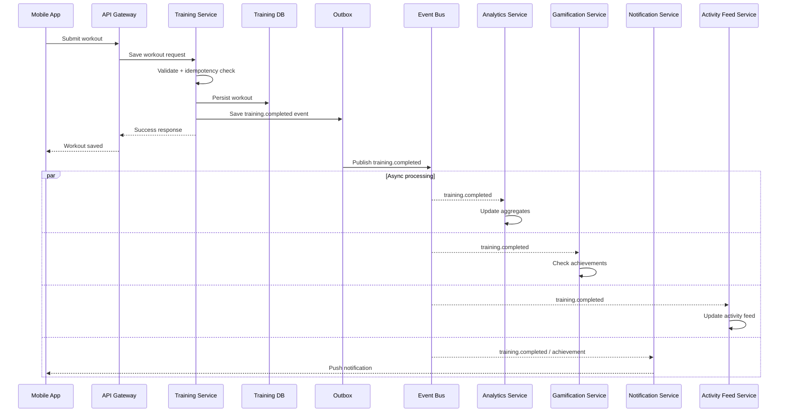
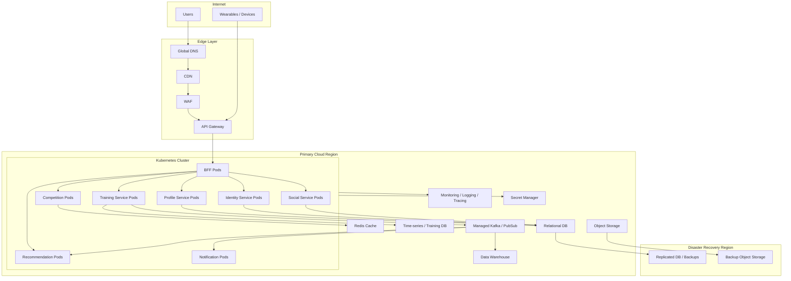
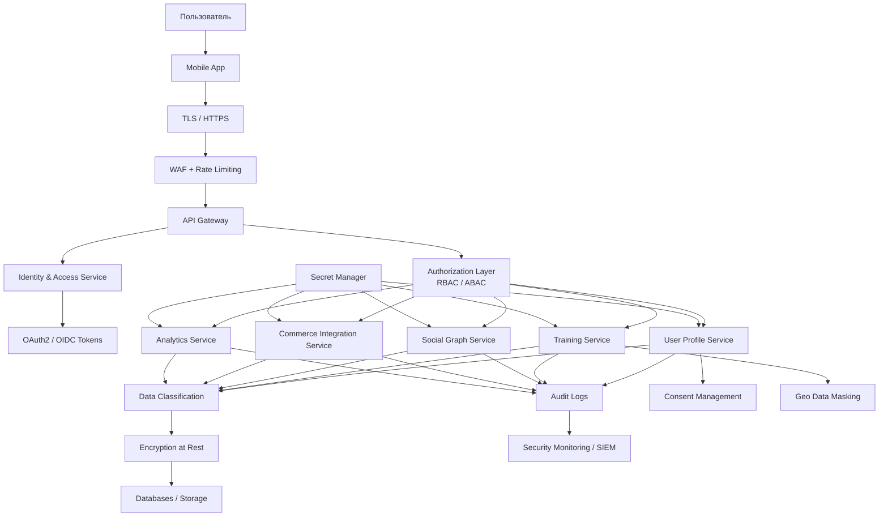

# №14: Основные архитектурные представления (Architecture Views)

---

**Назначение раздела:** Архитектурные представления описывают систему с разных точек зрения (viewpoints) для различных групп стейкхолдеров. В соответствии с заданием представлены пять основных представлений: функциональное, информационное, многозадачность (concurrency), инфраструктурное и безопасность. Каждое представление фокусируется на определённых аспектах системы и использует язык и уровень детализации, понятный соответствующей аудитории.

---

## 1. Функциональное представление (Functional View)

**Назначение:** Описывает, как система реализует функциональные требования, какие компоненты существуют, как они взаимодействуют и какие интерфейсы предоставляют.

### 1.1. Домены и их ответственность

| Домен | Ответственность | Ключевые функции | Взаимодействие с другими доменами |
|:---|:---|:---|:---|
| **Identity** | Аутентификация и управление доступом | Регистрация, вход (OAuth 2.0), MFA, управление сессиями, RBAC | ↔ Все домены (через API Gateway) |
| **User Profile** | Управление профилями, настройками и инвентарём | Профили, настройки приватности, инвентарь (обувь, снаряды), предпочтения | ↔ Identity, ↔ Training, ↔ Recommendation, ↔ Commerce |
| **Training** | Трекинг тренировок, хранение и анализ активности | Запись тренировок (GPS/пульс), история, календарь, сравнение с собой/регионом/профи | ↔ Device Integration, ↔ Recommendation, ↔ Gamification, ↔ Activity Feed |
| **Device Integration** | Подключение и интеграция внешних устройств и сервисов | BLE/ANT+ устройства, импорт из Garmin/Strava/Apple Health/Google Fit | ↔ Training, ↔ User Profile |
| **Social** | Социальные функции, связи между пользователями | Группы по интересам, друзья, подписки, чаты, поиск людей | ↔ Activity Feed, ↔ Notification, ↔ Gamification |
| **Activity Feed** | Лента активности и обновлений | Лента друзей, лента групп, публикации, комментарии, репосты | ↔ Social, ↔ Training, ↔ Gamification, ↔ Notification |
| **Gamification** | Игровые механики и мотивация | Уровни и XP, достижения (ачивки), виртуальные награды, индивидуальные челленджи | ↔ Training, ↔ Social, ↔ Competition, ↔ Notification |
| **Competition** | Массовые соревнования | Командные челленджи, глобальные рейтинги, турниры, сравнение с профессиональными спортсменами | ↔ Gamification, ↔ Training, ↔ Social |
| **Recommendation** | Персонализированные рекомендации и AI-коучинг | Генерация тренировочных планов, динамическая корректировка, рекомендации по замене инвентаря | ↔ Training, ↔ User Profile, ↔ Device Integration, ↔ Commerce, ↔ Promotion |
| **Notification** | Уведомления пользователей | Push-уведомления (Firebase/APNS), email-уведомления, in-app уведомления | ↔ Social, ↔ Activity Feed, ↔ Gamification, ↔ Competition, ↔ Promotion |
| **Promotion** | Промоакции, новости и B2B-платформа | Региональные промоакции, новости спорта, админ-панель для партнёров, публичное API, календарь событий | ↔ Notification, ↔ Recommendation, ↔ Commerce, ↔ Identity |
| **Commerce** | Монетизация и интеграция с продажами | Подписки, платежи (Stripe/Apple Pay/Google Pay), бесшовная интеграция с legacy e-commerce, промокоды | ↔ User Profile, ↔ Recommendation, ↔ Promotion, ↔ Identity |

---

### 1.2. Взаимодействие доменов (Основные потоки)

| Поток | Описание | Участники (домены) | Протокол |
|:---|:---|:---|:---|
| **Запись тренировки** | Пользователь записывает тренировку с датчиками | Client → Identity → Training → Device Integration | REST/WebSocket |
| **Генерация AI-плана** | Пользователь запрашивает персонализированный план | Client → Identity → Recommendation → Training | REST |
| **Обновление инвентаря** | Тренировка завершена → обновление пробега | Training → Recommendation → User Profile | Асинхронный (Kafka) |
| **Начисление XP** | Тренировка завершена → начисление опыта | Training → Gamification | Асинхронный (Kafka) |
| **Публикация в ленте** | Тренировка завершена → обновление ленты друзей | Training → Activity Feed | Асинхронный (Kafka) |
| **Уведомление друзей** | Достижение побито → уведомление друзей | Gamification → Notification → Social | Асинхронный (Kafka) |
| **Рекомендация инвентаря** | Пробег превысил лимит → рекомендация | User Profile → Recommendation → Commerce | Синхронный (REST) |
| **Покупка инвентаря** | Пользователь покупает товар | Client → Commerce → Anti-Corruption Layer (legacy) | REST / SOAP |
| **Создание промоакции** | Партнёр создаёт региональную акцию | Client → Promotion | REST |
| **Регистрация на событие** | Пользователь регистрируется на забег | Client → Promotion → Commerce | REST |
| **Участие в челлендже** | Пользователь участвует в соревновании | Client → Competition → Training | REST |
| **Поиск пользователей** | Пользователь ищет людей рядом | Client → Social → Activity Feed | REST |

---

### 1.3. Матрица взаимодействия доменов

| → | Identity | User Profile | Training | Device Integration | Social | Activity Feed | Gamification | Competition | Recommendation | Notification | Promotion | Commerce |
|:---|:---:|:---:|:---:|:---:|:---:|:---:|:---:|:---:|:---:|:---:|:---:|:---:|
| **Identity** | — | ✅ | — | — | — | — | — | — | — | — | ✅ | ✅ |
| **User Profile** | ✅ | — | ✅ | — | — | — | — | — | ✅ | — | — | ✅ |
| **Training** | — | ✅ | — | ✅ | — | ✅ | ✅ | ✅ | ✅ | — | — | — |
| **Device Integration** | — | — | ✅ | — | — | — | — | — | — | — | — | — |
| **Social** | — | — | — | — | — | ✅ | ✅ | ✅ | — | ✅ | — | — |
| **Activity Feed** | — | — | ✅ | — | ✅ | — | ✅ | — | — | ✅ | — | — |
| **Gamification** | — | — | ✅ | — | ✅ | ✅ | — | ✅ | — | ✅ | — | — |
| **Competition** | — | — | ✅ | — | ✅ | — | ✅ | — | — | ✅ | — | — |
| **Recommendation** | — | ✅ | ✅ | ✅ | — | — | — | — | — | — | ✅ | ✅ |
| **Notification** | — | — | — | — | ✅ | ✅ | ✅ | ✅ | — | — | ✅ | — |
| **Promotion** | ✅ | — | — | — | — | — | — | — | ✅ | ✅ | — | ✅ |
| **Commerce** | ✅ | ✅ | — | — | — | — | — | — | ✅ | — | ✅ | — |

**Легенда:** ✅ — взаимодействие присутствует, — — взаимодействие отсутствует.

---

## 2. Информационное представление (Information View)

**Назначение:** Описывает структуру данных, модели сущностей, потоки данных и способы хранения в разрезе доменов.

### 2.1. Основные сущности по доменам

| Домен | Сущности | Хранилище | Ключевые атрибуты |
|:---|:---|:---|:---|
| **Identity** | Пользователь (учётная запись), Роль, Сессия, Токен | PostgreSQL, Redis | id, email, password_hash, roles, refresh_token, last_login |
| **User Profile** | Профиль, Инвентарь, Настройки приватности, Предпочтения | PostgreSQL | id, user_id, имя, возраст, вес, рост, цели, приватность, инвентарь (тип, модель, пробег) |
| **Training** | Тренировка, Сегмент_трека, Статистика, Рекорд | TimescaleDB, PostgreSQL | id, user_id, тип, дата, дистанция, темп, пульс, GPS-трек, VO2max |
| **Device Integration** | Устройство, Сессия_устройства, Импорт_данных | PostgreSQL | id, user_id, тип_устройства, протокол (BLE/ANT+), статус, последняя_синхронизация |
| **Social** | Группа, Дружба, Сообщение, Чат, Участник_группы | PostgreSQL, Neo4j | id, название, описание, тип (открытая/закрытая), статус_дружбы, сообщения |
| **Activity Feed** | Пост, Лента, Комментарий, Реакция | PostgreSQL, Elasticsearch | id, user_id, тип_события (тренировка/достижение), контент, timestamp |
| **Gamification** | Уровень, XP, Достижение, Виртуальная_награда, Челлендж (индивидуальный) | PostgreSQL | id, user_id, уровень, xp, достижения (тип, название, дата), баланс_монет |
| **Competition** | Командный_челлендж, Рейтинг, Соревнование, Участник_команды | PostgreSQL | id, название, команды, рейтинг, призовой_фонд, дата_начала/конца |
| **Recommendation** | AI_план, Рекомендация, Инвентарная_рекомендация | PostgreSQL, DWH/BigQuery | id, user_id, тип_рекомендации, параметры, модель_версия |
| **Notification** | Уведомление, Шаблон_уведомления, Настройка_уведомлений | PostgreSQL, Firebase | id, user_id, тип (push/email/in-app), статус (отправлено/прочитано), контент |
| **Promotion** | Промоакция, Новость, Событие, Партнёр, Статистика_акции | PostgreSQL, Elasticsearch | id, партнёр, название, регион, период, целевая_аудитория, просмотры, конверсия |
| **Commerce** | Подписка, Платёж, Заказ, Промокод, Интеграция_с_legacy | PostgreSQL | id, user_id, тип_подписки, платёж, статус_заказа, интеграционные_данные |

---

## 2.2. Потоки данных между доменами

| Поток | Источник → Назначение | Формат | Частота | Задержка | Домен-источник | Домен-назначение |
|:---|:---|:---|:---|:---|:---|:---|
| **Запись тренировки** | Device Integration → Training → TimescaleDB | JSON | Высокая (до 5M/день) | < 200 мс | Device Integration | Training |
| **Обновление инвентаря** | Training → Recommendation → User Profile | Событие | Высокая | < 1 мин (асинхронно) | Training | User Profile |
| **Начисление XP** | Training → Gamification | Событие | Высокая | < 1 мин | Training | Gamification |
| **Публикация в ленте** | Training → Activity Feed | Событие | Высокая | < 1 мин | Training | Activity Feed |
| **Уведомления** | Gamification → Notification → Social | Событие | Средняя | < 5 мин | Gamification | Notification, Social |
| **Поиск пользователей** | Client → Social → Elasticsearch | Запрос-ответ | Средняя | < 300 мс | Client | Social |
| **Рекомендация инвентаря** | User Profile → Recommendation → Commerce | Запрос-ответ | Низкая | < 1 с | User Profile | Recommendation, Commerce |
| **Генерация AI-плана** | Client → Recommendation → Training | Запрос-ответ | Низкая | < 2 с | Client | Recommendation, Training |
| **Создание промоакции** | Client → Promotion → Commerce | Запрос-ответ | Низкая | < 1 с | Client | Promotion, Commerce |
| **Регистрация на событие** | Client → Promotion → Commerce | Запрос-ответ | Средняя | < 1 с | Client | Promotion, Commerce |
| **Участие в челлендже** | Client → Competition → Training | Запрос-ответ | Средняя | < 500 мс | Client | Competition, Training |

---

## 3. Представление многозадачности (Concurrency View)

**Назначение:** Описывает, как система обрабатывает параллельные запросы, конкурентный доступ к ресурсам и обеспечивает согласованность данных в разрезе доменов.

### 3.1. Стратегии обработки параллелизма по доменам

| Домен | Стратегия | Реализация | Обоснование |
|:---|:---|:---|:---|
| **Training** | Асинхронная обработка через Kafka + партиционирование TimescaleDB | Запись → Kafka → потребители | Разгрузка критического пути; гарантированная доставка; масштабируемость |
| **Recommendation** | Асинхронная обработка; CQRS для чтения | Отдельные модели для чтения | Снижение нагрузки на OLTP-БД; быстрые запросы |
| **Social** | Графовая БД (Neo4j) для быстрых запросов связей; кеширование в Redis | Neo4j + Redis | Высоконагруженные запросы связей (друзья, группы) |
| **Gamification** | Оптимистическая блокировка для обновления XP/уровней | Версионирование в PostgreSQL | Предотвращение конфликтов при одновременных обновлениях |
| **Commerce** | Saga Pattern (Choreography) для распределённых транзакций | События через Kafka; компенсирующие операции | Сохранение согласованности без 2PC |
| **Notification** | Асинхронная отправка через очереди | Kafka → Firebase/APNS | Отправка не блокирует основные потоки |
| **All domains** | Горизонтальное масштабирование (stateless сервисы) | Kubernetes HPA, множество реплик | Обработка до 10,000 RPS |

### 3.2. Обработка пиковых нагрузок по доменам

| Домен | Механизм | Реализация | Когда применяется |
|:---|:---|:---|:---|
| **Training** | Rate Limiting + Autoscaling | API Gateway + Kubernetes HPA | При пиковых нагрузках (марафоны) |
| **Recommendation** | Асинхронная генерация + кеширование | Kafka очередь + Redis | При высокой нагрузке на AI-вычисления |
| **Social** | Кеширование графовых запросов | Redis + Neo4j | При частых запросах друзей/групп |
| **All domains** | Circuit Breaker | Istio / Resilience4j | При сбоях внешних API |
| **All domains** | Bulkhead (изоляция пулов потоков) | Разделение ресурсов по доменам | Защита от каскадных отказов |
| **All domains** | Graceful Degradation | Отключение некритичных функций (Recommendation при перегрузке) | При превышении 80% ёмкости |

---

## 4. Инфраструктурное представление (Infrastructure View)

**Назначение:** Описывает физическую инфраструктуру, развертывание компонентов, сетевое взаимодействие и среду выполнения в разрезе доменов.

---

## Основной функциональный поток
Тренировка является центральным событием системы:

```text
Workout completed
      ↓
Training Service
      ↓
Event Bus
      ↓
Analytics / Gamification / Notification / Recommendation
```



---

# 14.2. Информационное представление

Информационное представление описывает основные данные системы.

## Основные сущности

| Сущность | Описание |
|---|---|
| User | Пользователь |
| Profile | Спортивный профиль |
| Workout | Тренировка |
| WorkoutMetrics | Метрики тренировки |
| Device | Устройство |
| InventoryItem | Инвентарь |
| Group | Социальная группа |
| Challenge | Челлендж |
| Competition | Соревнование |
| Achievement | Достижение |
| Promotion | Промоакция |
| Recommendation | Рекомендация |

## Классы данных по чувствительности

| Класс | Примеры | Защита |
|---|---|---|
| Public | публичные достижения | базовая |
| Personal | имя, регион | доступ по ролям |
| Sensitive | здоровье, маршруты | шифрование, аудит |
| Commercial | промо, заказы | контроль доступа |
| Operational | логи, метрики | retention policy |

## Подход к хранению
- транзакционные данные — relational DB;
- телеметрия — time-series / wide-column;
- события — event log;
- аналитика — warehouse;
- кэш — Redis;
- социальные связи — graph-like model.



---

# 14.3. Представление многозадачности / concurrency

Это представление показывает, как система справляется с параллельными запросами, асинхронными процессами и пиковыми нагрузками.

## Основные источники параллелизма
- одновременная запись тренировок;
- массовые соревнования;
- рассылка уведомлений;
- обновление лент активности;
- пересчёт достижений;
- загрузка данных с устройств.

## Основные паттерны

### 1. Idempotency
Повторная отправка тренировки не должна создавать дубликат.

### 2. Outbox Pattern
Если сервис сохранил тренировку, событие о ней не должно потеряться.

### 3. Retry + DLQ
Ошибочные события не теряются, а попадают в отдельную очередь.

### 4. CQRS для тяжёлых read-сценариев
Leaderboard и аналитика читаются из подготовленных моделей.

### 5. Backpressure
При пиках система ограничивает скорость обработки, чтобы не упасть полностью.


---

# 14.4. Инфраструктурное представление

## Основные элементы
- Kubernetes clusters;
- managed databases;
- Kafka/PubSub;
- CDN;
- API Gateway;
- object storage;
- monitoring stack;
- secret manager.

## Среды
- dev;
- test;
- staging;
- production.

## Развёртывание
- CI/CD pipeline;
- blue-green или canary deployments;
- infrastructure as code;
- automated rollback.

## Multi-region подход
Для MVP достаточно одного основного региона и disaster recovery.  
Для глобального масштаба — несколько регионов с локализацией данных.


---

# 14.5. Представление безопасности

## Основные угрозы
- кража аккаунта;
- утечка маршрутов;
- несанкционированный доступ к данным здоровья;
- злоупотребление социальными функциями;
- компрометация API;
- утечка токенов устройств.

## Меры безопасности
- OAuth2/OIDC;
- MFA для чувствительных операций;
- TLS everywhere;
- encryption at rest;
- RBAC/ABAC;
- audit logs;
- secrets management;
- WAF;
- rate limiting;
- privacy settings;
- consent management.

## Privacy by default
По умолчанию чувствительные данные не должны быть публичными:
- точные маршруты скрыты;
- активность видна только выбранной аудитории;
- текущая геолокация не раскрывается без явного согласия.


