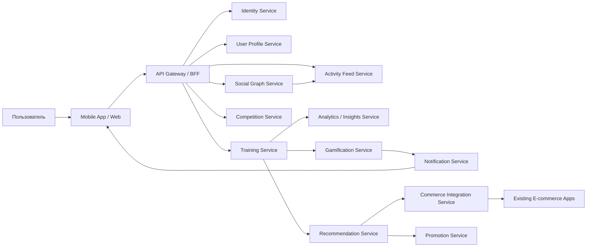
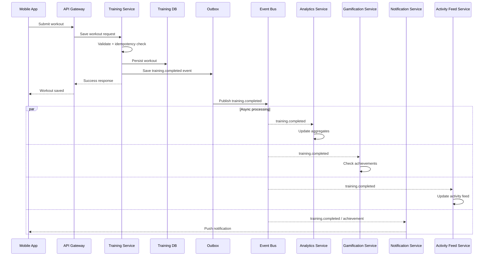
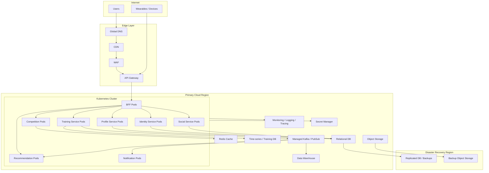

# №14: Основные архитектурные представления (Architecture Views)

---

**Назначение раздела:** Архитектурные представления описывают систему с разных точек зрения (viewpoints) для различных групп стейкхолдеров. В соответствии с заданием представлены пять основных представлений: функциональное, информационное, многозадачность (concurrency), инфраструктурное и безопасность. Каждое представление фокусируется на определённых аспектах системы и использует язык и уровень детализации, понятный соответствующей аудитории.

---

## 1. Функциональное представление (Functional View)

**Назначение:** Описывает, как система реализует функциональные требования, какие компоненты существуют, как они взаимодействуют и какие интерфейсы предоставляют.

### 1.1. Домены и их ответственность

| Домен | Ответственность | Ключевые функции | Взаимодействие с другими доменами |
|:---|:---|:---|:---|
| **Identity** | Аутентификация и управление доступом | Регистрация, вход (OAuth 2.0), MFA, управление сессиями, RBAC | ↔ Все домены (через API Gateway) |
| **User Profile** | Управление профилями, настройками и инвентарём | Профили, настройки приватности, инвентарь (обувь, снаряды), предпочтения | ↔ Identity, ↔ Training, ↔ Recommendation, ↔ Commerce |
| **Training** | Трекинг тренировок, хранение и анализ активности | Запись тренировок (GPS/пульс), история, календарь, сравнение с собой/регионом/профи | ↔ Device Integration, ↔ Recommendation, ↔ Gamification, ↔ Activity Feed |
| **Device Integration** | Подключение и интеграция внешних устройств и сервисов | BLE/ANT+ устройства, импорт из Garmin/Strava/Apple Health/Google Fit | ↔ Training, ↔ User Profile |
| **Social** | Социальные функции, связи между пользователями | Группы по интересам, друзья, подписки, чаты, поиск людей | ↔ Activity Feed, ↔ Notification, ↔ Gamification |
| **Activity Feed** | Лента активности и обновлений | Лента друзей, лента групп, публикации, комментарии, репосты | ↔ Social, ↔ Training, ↔ Gamification, ↔ Notification |
| **Gamification** | Игровые механики и мотивация | Уровни и XP, достижения (ачивки), виртуальные награды, индивидуальные челленджи | ↔ Training, ↔ Social, ↔ Competition, ↔ Notification |
| **Competition** | Массовые соревнования | Командные челленджи, глобальные рейтинги, турниры, сравнение с профессиональными спортсменами | ↔ Gamification, ↔ Training, ↔ Social |
| **Recommendation** | Персонализированные рекомендации и AI-коучинг | Генерация тренировочных планов, динамическая корректировка, рекомендации по замене инвентаря | ↔ Training, ↔ User Profile, ↔ Device Integration, ↔ Commerce, ↔ Promotion |
| **Notification** | Уведомления пользователей | Push-уведомления (Firebase/APNS), email-уведомления, in-app уведомления | ↔ Social, ↔ Activity Feed, ↔ Gamification, ↔ Competition, ↔ Promotion |
| **Promotion** | Промоакции, новости и B2B-платформа | Региональные промоакции, новости спорта, админ-панель для партнёров, публичное API, календарь событий | ↔ Notification, ↔ Recommendation, ↔ Commerce, ↔ Identity |
| **Commerce** | Монетизация и интеграция с продажами | Подписки, платежи (Stripe/Apple Pay/Google Pay), бесшовная интеграция с legacy e-commerce, промокоды | ↔ User Profile, ↔ Recommendation, ↔ Promotion, ↔ Identity |

---

### 1.2. Взаимодействие доменов (Основные потоки)

| Поток | Описание | Участники (домены) | Протокол |
|:---|:---|:---|:---|
| **Запись тренировки** | Пользователь записывает тренировку с датчиками | Client → Identity → Training → Device Integration | REST/WebSocket |
| **Генерация AI-плана** | Пользователь запрашивает персонализированный план | Client → Identity → Recommendation → Training | REST |
| **Обновление инвентаря** | Тренировка завершена → обновление пробега | Training → Recommendation → User Profile | Асинхронный (Kafka) |
| **Начисление XP** | Тренировка завершена → начисление опыта | Training → Gamification | Асинхронный (Kafka) |
| **Публикация в ленте** | Тренировка завершена → обновление ленты друзей | Training → Activity Feed | Асинхронный (Kafka) |
| **Уведомление друзей** | Достижение побито → уведомление друзей | Gamification → Notification → Social | Асинхронный (Kafka) |
| **Рекомендация инвентаря** | Пробег превысил лимит → рекомендация | User Profile → Recommendation → Commerce | Синхронный (REST) |
| **Покупка инвентаря** | Пользователь покупает товар | Client → Commerce → Anti-Corruption Layer (legacy) | REST / SOAP |
| **Создание промоакции** | Партнёр создаёт региональную акцию | Client → Promotion | REST |
| **Регистрация на событие** | Пользователь регистрируется на забег | Client → Promotion → Commerce | REST |
| **Участие в челлендже** | Пользователь участвует в соревновании | Client → Competition → Training | REST |
| **Поиск пользователей** | Пользователь ищет людей рядом | Client → Social → Activity Feed | REST |

---

### 1.3. Матрица взаимодействия доменов

| → | Identity | User Profile | Training | Device Integration | Social | Activity Feed | Gamification | Competition | Recommendation | Notification | Promotion | Commerce |
|:---|:---:|:---:|:---:|:---:|:---:|:---:|:---:|:---:|:---:|:---:|:---:|:---:|
| **Identity** | — | ✅ | — | — | — | — | — | — | — | — | ✅ | ✅ |
| **User Profile** | ✅ | — | ✅ | — | — | — | — | — | ✅ | — | — | ✅ |
| **Training** | — | ✅ | — | ✅ | — | ✅ | ✅ | ✅ | ✅ | — | — | — |
| **Device Integration** | — | — | ✅ | — | — | — | — | — | — | — | — | — |
| **Social** | — | — | — | — | — | ✅ | ✅ | ✅ | — | ✅ | — | — |
| **Activity Feed** | — | — | ✅ | — | ✅ | — | ✅ | — | — | ✅ | — | — |
| **Gamification** | — | — | ✅ | — | ✅ | ✅ | — | ✅ | — | ✅ | — | — |
| **Competition** | — | — | ✅ | — | ✅ | — | ✅ | — | — | ✅ | — | — |
| **Recommendation** | — | ✅ | ✅ | ✅ | — | — | — | — | — | — | ✅ | ✅ |
| **Notification** | — | — | — | — | ✅ | ✅ | ✅ | ✅ | — | — | ✅ | — |
| **Promotion** | ✅ | — | — | — | — | — | — | — | ✅ | ✅ | — | ✅ |
| **Commerce** | ✅ | ✅ | — | — | — | — | — | — | ✅ | — | ✅ | — |

**Легенда:** ✅ — взаимодействие присутствует, — — взаимодействие отсутствует.

---

## 2. Информационное представление (Information View)

**Назначение:** Описывает структуру данных, модели сущностей, потоки данных и способы хранения в разрезе доменов.

### 2.1. Основные сущности по доменам

| Домен | Сущности | Хранилище | Ключевые атрибуты |
|:---|:---|:---|:---|
| **Identity** | Пользователь (учётная запись), Роль, Сессия, Токен | PostgreSQL, Redis | id, email, password_hash, roles, refresh_token, last_login |
| **User Profile** | Профиль, Инвентарь, Настройки приватности, Предпочтения | PostgreSQL | id, user_id, имя, возраст, вес, рост, цели, приватность, инвентарь (тип, модель, пробег) |
| **Training** | Тренировка, Сегмент_трека, Статистика, Рекорд | TimescaleDB, PostgreSQL | id, user_id, тип, дата, дистанция, темп, пульс, GPS-трек, VO2max |
| **Device Integration** | Устройство, Сессия_устройства, Импорт_данных | PostgreSQL | id, user_id, тип_устройства, протокол (BLE/ANT+), статус, последняя_синхронизация |
| **Social** | Группа, Дружба, Сообщение, Чат, Участник_группы | PostgreSQL, Neo4j | id, название, описание, тип (открытая/закрытая), статус_дружбы, сообщения |
| **Activity Feed** | Пост, Лента, Комментарий, Реакция | PostgreSQL, Elasticsearch | id, user_id, тип_события (тренировка/достижение), контент, timestamp |
| **Gamification** | Уровень, XP, Достижение, Виртуальная_награда, Челлендж (индивидуальный) | PostgreSQL | id, user_id, уровень, xp, достижения (тип, название, дата), баланс_монет |
| **Competition** | Командный_челлендж, Рейтинг, Соревнование, Участник_команды | PostgreSQL | id, название, команды, рейтинг, призовой_фонд, дата_начала/конца |
| **Recommendation** | AI_план, Рекомендация, Инвентарная_рекомендация | PostgreSQL, DWH/BigQuery | id, user_id, тип_рекомендации, параметры, модель_версия |
| **Notification** | Уведомление, Шаблон_уведомления, Настройка_уведомлений | PostgreSQL, Firebase | id, user_id, тип (push/email/in-app), статус (отправлено/прочитано), контент |
| **Promotion** | Промоакция, Новость, Событие, Партнёр, Статистика_акции | PostgreSQL, Elasticsearch | id, партнёр, название, регион, период, целевая_аудитория, просмотры, конверсия |
| **Commerce** | Подписка, Платёж, Заказ, Промокод, Интеграция_с_legacy | PostgreSQL | id, user_id, тип_подписки, платёж, статус_заказа, интеграционные_данные |

---

## 2.2. Потоки данных между доменами

| Поток | Источник → Назначение | Формат | Частота | Задержка | Домен-источник | Домен-назначение |
|:---|:---|:---|:---|:---|:---|:---|
| **Запись тренировки** | Device Integration → Training → TimescaleDB | JSON | Высокая (до 5M/день) | < 200 мс | Device Integration | Training |
| **Обновление инвентаря** | Training → Recommendation → User Profile | Событие | Высокая | < 1 мин (асинхронно) | Training | User Profile |
| **Начисление XP** | Training → Gamification | Событие | Высокая | < 1 мин | Training | Gamification |
| **Публикация в ленте** | Training → Activity Feed | Событие | Высокая | < 1 мин | Training | Activity Feed |
| **Уведомления** | Gamification → Notification → Social | Событие | Средняя | < 5 мин | Gamification | Notification, Social |
| **Поиск пользователей** | Client → Social → Elasticsearch | Запрос-ответ | Средняя | < 300 мс | Client | Social |
| **Рекомендация инвентаря** | User Profile → Recommendation → Commerce | Запрос-ответ | Низкая | < 1 с | User Profile | Recommendation, Commerce |
| **Генерация AI-плана** | Client → Recommendation → Training | Запрос-ответ | Низкая | < 2 с | Client | Recommendation, Training |
| **Создание промоакции** | Client → Promotion → Commerce | Запрос-ответ | Низкая | < 1 с | Client | Promotion, Commerce |
| **Регистрация на событие** | Client → Promotion → Commerce | Запрос-ответ | Средняя | < 1 с | Client | Promotion, Commerce |
| **Участие в челлендже** | Client → Competition → Training | Запрос-ответ | Средняя | < 500 мс | Client | Competition, Training |

```mermaid
erDiagram
    %% Домен Identity
    USER ||--|| PROFILE : has
    USER ||--o{ SESSION : has
    USER ||--o{ ROLE : assigned

    %% Домен User Profile
    USER ||--o{ INVENTORY_ITEM : owns
    USER ||--o{ DEVICE : connects

    %% Домен Training
    USER ||--o{ WORKOUT : performs
    WORKOUT ||--o{ WORKOUT_METRICS : contains
    WORKOUT ||--o{ ROUTE_POINT : has
    USER ||--o{ RECORD : achieves

    %% Домен Device Integration
    DEVICE ||--o{ DEVICE_SESSION : creates

    %% Домен Social
    USER ||--o{ GROUP_MEMBERSHIP : participates
    GROUP ||--o{ GROUP_MEMBERSHIP : includes
    USER ||--o{ FRIENDSHIP : friends
    USER ||--o{ MESSAGE : sends
    USER ||--o{ MESSAGE : receives
    USER ||--o{ POST : creates
    GROUP ||--o{ POST : contains
    POST ||--o{ COMMENT : has
    POST ||--o{ REACTION : has

    %% Домен Activity Feed (Post, Comment, Reaction уже покрыты)
    %% Домен Gamification
    USER ||--o{ ACHIEVEMENT : unlocks
    USER ||--o{ LEVEL : has
    USER ||--o{ VIRTUAL_CURRENCY : holds

    %% Домен Competition
    USER ||--o{ CHALLENGE_PARTICIPANT : participates
    CHALLENGE ||--o{ CHALLENGE_PARTICIPANT : includes
    CHALLENGE ||--o{ WORKOUT : includes
    COMPETITION ||--o{ CHALLENGE : contains
    COMPETITION ||--o{ TEAM : has

    %% Домен Recommendation
    USER ||--o{ TRAINING_PLAN : follows
    USER ||--o{ RECOMMENDATION : receives
    RECOMMENDATION ||--o{ INVENTORY_ITEM : suggests

    %% Домен Notification
    USER ||--o{ NOTIFICATION : receives

    %% Домен Promotion
    PARTNER ||--o{ PROMOTION : creates
    PROMOTION ||--o{ RECOMMENDATION : used_in
    PARTNER ||--o{ EVENT : organizes
    USER ||--o{ EVENT_REGISTRATION : registers

    %% Домен Commerce
    USER ||--o{ SUBSCRIPTION : has
    SUBSCRIPTION ||--o{ PAYMENT : has
    USER ||--o{ ORDER : places
    ORDER ||--o{ ORDER_ITEM : contains

    %% Сущности и их атрибуты

    USER {
        string id PK
        string email
        string region
        string timezone
        datetime created_at
        boolean is_active
    }

    PROFILE {
        string user_id FK
        string full_name
        string sport_level
        string preferences
        string privacy_settings
        float weight
        float height
        date birth_date
    }

    SESSION {
        string id PK
        string user_id FK
        string token
        datetime created_at
        datetime expires_at
        string ip_address
    }

    ROLE {
        string id PK
        string name
        string permissions
    }

    INVENTORY_ITEM {
        string id PK
        string user_id FK
        string type
        string model
        string brand
        int usage_distance
        int threshold
        date purchase_date
    }

    DEVICE {
        string id PK
        string user_id FK
        string provider
        string type
        string model
        string last_sync
        boolean is_active
    }

    DEVICE_SESSION {
        string id PK
        string device_id FK
        datetime connected_at
        datetime disconnected_at
    }

    WORKOUT {
        string id PK
        string user_id FK
        string type
        datetime started_at
        datetime finished_at
        float distance
        int duration_sec
        float avg_pace
        int avg_heart_rate
    }

    WORKOUT_METRICS {
        string workout_id FK
        float pace
        int heart_rate_avg
        int heart_rate_max
        int calories
        float cadence
        float power
    }

    ROUTE_POINT {
        string workout_id FK
        float lat
        float lng
        float altitude
        datetime timestamp
    }

    RECORD {
        string id PK
        string user_id FK
        string type
        float value
        datetime achieved_at
    }

    GROUP {
        string id PK
        string name
        string description
        string type
        string location
        datetime created_at
    }

    GROUP_MEMBERSHIP {
        string user_id FK
        string group_id FK
        string role
        datetime joined_at
    }

    FRIENDSHIP {
        string user_id FK
        string friend_id FK
        string status
        datetime created_at
    }

    MESSAGE {
        string id PK
        string sender_id FK
        string receiver_id FK
        string group_id FK
        string content
        datetime sent_at
        boolean is_read
    }

    POST {
        string id PK
        string user_id FK
        string group_id FK
        string content
        datetime created_at
        string media_url
    }

    COMMENT {
        string id PK
        string post_id FK
        string user_id FK
        string content
        datetime created_at
    }

    REACTION {
        string id PK
        string post_id FK
        string user_id FK
        string type
    }

    ACHIEVEMENT {
        string id PK
        string user_id FK
        string type
        string name
        string description
        datetime earned_at
    }

    LEVEL {
        string user_id FK
        int level
        int xp
        int xp_next
    }

    VIRTUAL_CURRENCY {
        string user_id FK
        int coins
        int bonus_points
    }

    CHALLENGE {
        string id PK
        string competition_id FK
        string name
        string description
        datetime start_date
        datetime end_date
        string type
        float target_value
    }

    CHALLENGE_PARTICIPANT {
        string user_id FK
        string challenge_id FK
        string team_id FK
        float progress
        datetime joined_at
    }

    TEAM {
        string id PK
        string competition_id FK
        string name
        int member_count
    }

    COMPETITION {
        string id PK
        string name
        datetime start_date
        datetime end_date
        string region
        string type
    }

    TRAINING_PLAN {
        string id PK
        string user_id FK
        string name
        datetime generated_at
        string schedule
        string goal
    }

    RECOMMENDATION {
        string id PK
        string user_id FK
        string inventory_item_id FK
        string type
        string content
        datetime created_at
        boolean is_accepted
    }

    NOTIFICATION {
        string id PK
        string user_id FK
        string type
        string content
        datetime sent_at
        boolean is_read
    }

    PARTNER {
        string id PK
        string name
        string region
        string contact_email
        string contact_phone
        datetime registered_at
    }

    PROMOTION {
        string id PK
        string partner_id FK
        string title
        string description
        string region
        datetime start_date
        datetime end_date
        string target_audience
        float discount
    }

    EVENT {
        string id PK
        string partner_id FK
        string name
        datetime date
        string location
        string description
        string registration_url
    }

    EVENT_REGISTRATION {
        string user_id FK
        string event_id FK
        datetime registered_at
        string status
    }

    SUBSCRIPTION {
        string id PK
        string user_id FK
        string tier
        datetime start_date
        datetime end_date
        string status
    }

    PAYMENT {
        string id PK
        string subscription_id FK
        float amount
        string currency
        datetime paid_at
        string status
        string transaction_id
    }

    ORDER {
        string id PK
        string user_id FK
        float total
        datetime ordered_at
        string status
        string shipping_address
    }

    ORDER_ITEM {
        string order_id FK
        string product_sku
        int quantity
        float price
    }
```

---

### Пояснение к ER-диаграмме

- **USER** — центральная сущность, связанная со всеми доменами.
- **PROFILE** и **SESSION** — расширяют информацию о пользователе и управление сессиями.
- **INVENTORY_ITEM** и **DEVICE** — отражают инвентарь и подключённые устройства.
- **WORKOUT**, **WORKOUT_METRICS**, **ROUTE_POINT** — хранят данные тренировок.
- **RECORD** — личные рекорды пользователя.
- **GROUP**, **GROUP_MEMBERSHIP**, **FRIENDSHIP**, **MESSAGE**, **POST**, **COMMENT**, **REACTION** — покрывают социальную функциональность.
- **ACHIEVEMENT**, **LEVEL**, **VIRTUAL_CURRENCY** — реализуют геймификацию.
- **CHALLENGE**, **CHALLENGE_PARTICIPANT**, **TEAM**, **COMPETITION** — описывают соревнования и челленджи.
- **TRAINING_PLAN**, **RECOMMENDATION** — обеспечивают AI-рекомендации.
- **NOTIFICATION** — управляет уведомлениями.
- **PARTNER**, **PROMOTION**, **EVENT**, **EVENT_REGISTRATION** — закрывают B2B-платформу и промоакции.
- **SUBSCRIPTION**, **PAYMENT**, **ORDER**, **ORDER_ITEM** — отвечают за монетизацию и интеграцию с e-commerce.

Все домены покрыты, связи обозначены явно (один-к-одному, один-ко-многим, многие-ко-многим через промежуточные таблицы).

---

## 3. Представление многозадачности (Concurrency View)

**Назначение:** Описывает, как система обрабатывает параллельные запросы, конкурентный доступ к ресурсам и обеспечивает согласованность данных в разрезе доменов.

### 3.1. Стратегии обработки параллелизма по доменам

| Домен | Стратегия | Реализация | Обоснование |
|:---|:---|:---|:---|
| **Training** | Асинхронная обработка через Kafka + партиционирование TimescaleDB | Запись → Kafka → потребители | Разгрузка критического пути; гарантированная доставка; масштабируемость |
| **Recommendation** | Асинхронная обработка; CQRS для чтения | Отдельные модели для чтения | Снижение нагрузки на OLTP-БД; быстрые запросы |
| **Social** | Графовая БД (Neo4j) для быстрых запросов связей; кеширование в Redis | Neo4j + Redis | Высоконагруженные запросы связей (друзья, группы) |
| **Gamification** | Оптимистическая блокировка для обновления XP/уровней | Версионирование в PostgreSQL | Предотвращение конфликтов при одновременных обновлениях |
| **Commerce** | Saga Pattern (Choreography) для распределённых транзакций | События через Kafka; компенсирующие операции | Сохранение согласованности без 2PC |
| **Notification** | Асинхронная отправка через очереди | Kafka → Firebase/APNS | Отправка не блокирует основные потоки |
| **All domains** | Горизонтальное масштабирование (stateless сервисы) | Kubernetes HPA, множество реплик | Обработка до 10,000 RPS |

### 3.2. Обработка пиковых нагрузок по доменам

| Домен | Механизм | Реализация | Когда применяется |
|:---|:---|:---|:---|
| **Training** | Rate Limiting + Autoscaling | API Gateway + Kubernetes HPA | При пиковых нагрузках (марафоны) |
| **Recommendation** | Асинхронная генерация + кеширование | Kafka очередь + Redis | При высокой нагрузке на AI-вычисления |
| **Social** | Кеширование графовых запросов | Redis + Neo4j | При частых запросах друзей/групп |
| **All domains** | Circuit Breaker | Istio / Resilience4j | При сбоях внешних API |
| **All domains** | Bulkhead (изоляция пулов потоков) | Разделение ресурсов по доменам | Защита от каскадных отказов |
| **All domains** | Graceful Degradation | Отключение некритичных функций (Recommendation при перегрузке) | При превышении 80% ёмкости |

---
## 4. Инфраструктурное представление (Infrastructure View)

### 4.1. Инфраструктурная схема развертывания

```mermaid
flowchart TB
    %% Клиентский слой
    subgraph ClientLayer["Клиентский слой"]
        iOS["Мобильное приложение iOS"]
        Android["Мобильное приложение Android"]
        Web["Веб-портал для партнёров"]
        Devices["Внешние устройства BLE/ANT+"]
    end

    %% Слой доступа
    subgraph EdgeLayer["Слой доступа"]
        APIGateway["API Gateway (Kong/Envoy) + WAF"]
        BFF["BFF (Backend for Frontend)"]
        RedisCache["Redis (Кеш)"]
    end

    %% Multi-Cloud инфраструктура
    subgraph MultiCloud["Multi-Cloud Инфраструктура"]
        subgraph RegionA["Регион A (AWS)"]
            K8sA["Kubernetes EKS"]
            ServicesA["Сервисы:<br>Identity<br>User Profile<br>Social<br>Activity Feed<br>Notification"]
            DataA["Данные:<br>PostgreSQL (OLTP)<br>Elasticsearch (Поиск)<br>Redis (Кеш)"]
        end
        subgraph RegionB["Регион B (GCP)"]
            K8sB["Kubernetes GKE"]
            ServicesB["Сервисы:<br>Training<br>Device Integration<br>Gamification<br>Competition<br>Recommendation"]
            DataB["Данные:<br>TimescaleDB (Time-series)<br>Neo4j (Графовая)<br>Kafka (Event Bus)"]
        end
        subgraph RegionC["Регион C (Azure)"]
            K8sC["Kubernetes AKS"]
            ServicesC["Сервисы:<br>Promotion<br>Commerce"]
            DataC["Данные:<br>DWH / BigQuery (Аналитика)<br>MinIO / S3 (Объектное)"]
        end
    end

    %% Мониторинг и наблюдаемость
    subgraph Observability["Мониторинг и наблюдаемость"]
        Prometheus["Prometheus + Grafana"]
        ELK["ELK Stack (Логи)"]
        Jaeger["Jaeger (Трассировка)"]
        Istio["Service Mesh (Istio/Linkerd)"]
    end

    %% Внешние интеграции
    subgraph ExternalIntegrations["Внешние интеграции"]
        Legacy["Legacy e-commerce (SOAP/REST)"]
        Payments["Платёжные системы (Stripe/Apple Pay)"]
        Wearable["Wearable APIs (Garmin/Polar/Suunto)"]
        Health["Apple Health / Google Fit"]
        Maps["Картографические сервисы (Mapbox/Google Maps)"]
        Weather["Погодные сервисы"]
    end

    %% Связи клиент → API Gateway
    iOS --> APIGateway
    Android --> APIGateway
    Web --> APIGateway
    Devices --> APIGateway

    %% API Gateway → BFF и кеш
    APIGateway --> BFF
    APIGateway --> RedisCache
    BFF --> RedisCache

    %% BFF → Сервисы в регионах
    BFF --> ServicesA
    BFF --> ServicesB
    BFF --> ServicesC

    %% Сервисы → Данные
    ServicesA --> DataA
    ServicesB --> DataB
    ServicesC --> DataC

    %% Kubernetes управляет сервисами
    K8sA --> ServicesA
    K8sB --> ServicesB
    K8sC --> ServicesC

    %% Мониторинг всех сервисов
    ServicesA --> Prometheus
    ServicesB --> Prometheus
    ServicesC --> Prometheus
    ServicesA --> ELK
    ServicesB --> ELK
    ServicesC --> ELK
    ServicesA --> Jaeger
    ServicesB --> Jaeger
    ServicesC --> Jaeger
    ServicesA --> Istio
    ServicesB --> Istio
    ServicesC --> Istio

    %% Внешние интеграции (только нужные домены)
    ServicesC --> Legacy
    ServicesC --> Payments
    ServicesB --> Wearable
    ServicesB --> Health
    ServicesB --> Maps
    ServicesB --> Weather
```

---

# 14.4. Инфраструктурное представление

## Основные элементы
- Kubernetes clusters;
- managed databases;
- Kafka/PubSub;
- CDN;
- API Gateway;
- object storage;
- monitoring stack;
- secret manager.

## Среды
- dev;
- test;
- staging;
- production.

## Развёртывание
- CI/CD pipeline;
- blue-green или canary deployments;
- infrastructure as code;
- automated rollback.

## Multi-region подход
Для MVP достаточно одного основного региона и disaster recovery.  
Для глобального масштаба — несколько регионов с локализацией данных.

---

### Описание инфраструктурной схемы развертывания

| Уровень | Компоненты | Назначение |
|:---|:---|:---|
| **Клиентский слой** | iOS, Android, Web, BLE/ANT+ | Пользовательские интерфейсы и устройства |
| **Слой доступа** | API Gateway, BFF, Redis | Единая точка входа, кеширование, агрегация |
| **Регион A (AWS)** | Identity, User Profile, Social, Activity Feed, Notification; PostgreSQL, Elasticsearch, Redis | Транзакционные и социальные данные |
| **Регион B (GCP)** | Training, Device Integration, Gamification, Competition, Recommendation; TimescaleDB, Neo4j, Kafka | Трекинг, ML, соревнования, события |
| **Регион C (Azure)** | Promotion, Commerce; DWH/BigQuery, MinIO/S3 | B2B, аналитика, монетизация |
| **Мониторинг** | Prometheus, ELK, Jaeger, Istio | Метрики, логи, трассировка, безопасность |
| **Внешние интеграции** | Legacy e-commerce, платежи, устройства, карты, погода | Интеграция с внешними системами |

# №14: Основные архитектурные представления (Architecture Views)

## 4.2. Компоненты инфраструктуры по доменам

| Компонент | Технология | Размещение (регион) | Домены | Масштабирование |
|:---|:---|:---|:---|:---|
| **API Gateway** | Kong / Envoy | Все регионы | Все домены | Горизонтальное (3+ реплик) |
| **Identity** | Keycloak / Auth0 | Регион А | Identity | Горизонтальное (3+ реплик) |
| **User Profile** | Spring Boot / Python | Регион А | User Profile | Горизонтальное (3+ реплик) |
| **Training** | Spring Boot / Python | Регион Б | Training | Горизонтальное (5+ реплик) |
| **Device Integration** | Spring Boot / Python | Регион Б | Device Integration | Горизонтальное (3+ реплик) |
| **Social** | Spring Boot / Python | Регион А | Social, Activity Feed | Горизонтальное (3+ реплик) |
| **Gamification** | Spring Boot / Python | Регион Б | Gamification, Competition | Горизонтальное (3+ реплик) |
| **Recommendation** | Python (FastAPI) | Регион Б | Recommendation | Горизонтальное (GPU-инстансы) |
| **Notification** | Spring Boot / Python | Регион А | Notification | Горизонтальное (3+ реплик) |
| **Promotion** | Spring Boot / Python | Регион С | Promotion | Горизонтальное (3+ реплик) |
| **Commerce** | Spring Boot / Python | Регион С | Commerce | Горизонтальное (3+ реплик) |
| **PostgreSQL** | AWS RDS / GCP Cloud SQL | Регион А | Identity, User Profile, Social, Gamification, Promotion, Commerce | Шардирование + реплики |
| **TimescaleDB** | Timescale Cloud | Регион Б | Training | Партиционирование |
| **Elasticsearch** | Elastic Cloud | Регион А | Social, Promotion | Шардирование |
| **Redis** | Redis Cloud / Elasticache | Все регионы | Все домены | Кластеризация |
| **Neo4j** | Neo4j Aura | Регион Б | Social | Репликация |
| **Kafka** | Confluent Cloud / MSK | Все регионы | Training, Gamification, Activity Feed, Notification | Кластер (3+ брокеров) |
| **MinIO / S3** | AWS S3 / MinIO | Регион С | User Profile, Promotion | — |
| **DWH / BigQuery** | BigQuery / Snowflake | Регион С | Recommendation, Commerce | — |

---

## 4.3. Сетевые взаимодействия и безопасность по доменам

| Взаимодействие | Протокол | Безопасность | Домены |
|:---|:---|:---|:---|
| **Клиент → API Gateway** | HTTPS (TLS 1.3) | OAuth 2.0 + JWT | Все домены |
| **API Gateway → Домены** | gRPC / REST (TLS) | mTLS (Service Mesh) | Все домены |
| **Домены → Kafka** | TLS | SSL-аутентификация | Training, Gamification, Activity Feed, Notification |
| **Домены → БД** | TLS | Шифрование на уровне приложения | Все домены (кроме Training через TimescaleDB) |
| **Commerce → Legacy** | SOAP / REST (TLS) | API-ключи, mTLS | Commerce |
| **Recommendation → DWH** | JDBC / ODBC (TLS) | Шифрование | Recommendation |
| **Notification → Firebase/APNS** | HTTP/2 (TLS) | Сервисные аккаунты | Notification |

---

## 5. Представление безопасности (Security View)

**Назначение:** Описывает меры безопасности на всех уровнях системы: аутентификация, авторизация, шифрование, защита от атак, соответствие регуляторным требованиям в разрезе доменов.

### 5.1. Модель безопасности по доменам

Модель безопасности построена по пятиуровневому принципу, где каждый уровень отвечает за свой аспект защиты:

Уровень 1: Аутентификация и управление доступом (домен Identity)
Здесь реализована централизованная аутентификация через OAuth 2.0 и OpenID Connect на базе Keycloak или Auth0. Пользователи могут входить через социальные сети (Google, Apple, Facebook) или по классической связке email/пароль. Пароли защищены политикой сложности, а для особо важных операций доступна многофакторная аутентификация. Управление сессиями построено на JWT-токенах с коротким временем жизни (15 минут) и refresh-токенами (7 дней). Единый вход работает для всех доменов системы.

Уровень 2: Авторизация и ролевая модель (RBAC)
Доступ к функциям разграничен по ролям. Обычный пользователь работает только со своими данными и социальными функциями. Модератор может управлять группами и контентом в ленте. Партнёр получает доступ к созданию промоакций и B2B-панели. Администратор управляет пользователями и системными настройками, а суперадминистратор имеет полный доступ ко всем доменам. Эта модель сквозная и применяется во всех компонентах.

Уровень 3: Защита данных на уровне хранения
Персональные данные (PII) в доменах Identity и User Profile шифруются с использованием AES-256. Данные о здоровье (PHI) в домене Training шифруются на уровне приложения, чтобы даже при компрометации базы данных они оставались недоступными. Платёжные данные в домене Commerce обрабатываются через сертифицированные PCI DSS-решения, само приложение не хранит номера карт. Для всех данных используется шифрование в транзите через TLS 1.3. Дополнительно применяется географическое шардирование — данные пользователя физически хранятся в том регионе, где он зарегистрирован.

Уровень 4: Защита API и сетевого периметра
Единой точкой входа для всех запросов служит API Gateway, который выполняет первичную валидацию JWT-токенов. На этом уровне настроено ограничение частоты запросов: 100 запросов в минуту для обычных пользователей и 1000 для партнёров. Внедрён Web Application Firewall для защиты от DDoS и других атак. Для партнёрских интеграций используется белый список IP-адресов. Внутреннее взаимодействие между микросервисами защищено mTLS через Service Mesh на базе Istio.

Уровень 5: Аудит и соответствие регуляторным требованиям
Все критичные действия логируются в Event Store с сохранением контекста (кто, что, когда, с каким результатом). Реализованы механизмы "права на забвение" — пользователь может запросить полное удаление своих данных, которое выполняется в течение 30 дней. Предусмотрен экспорт всех данных пользователя в структурированном формате. Система соответствует требованиям GDPR для Европы, CCPA для Калифорнии, 152-ФЗ для России. Регулярно проводятся пентесты (не реже раза в квартал) и ведётся мониторинг угроз с использованием SIEM/IDS-систем.

## 5.3. Соответствие регуляторным требованиям по доменам

| Требование | Реализация | Затронутые домены |
|:---|:---|:---|
| **GDPR (Европа)** | Данные хранятся в ЕС; право на забвение; экспорт данных | Identity, User Profile, Training, Social |
| **CCPA (Калифорния)** | Возможность отказа от продажи данных; удаление данных | Identity, User Profile, Commerce |
| **152-ФЗ (Россия)** | Хранение данных граждан РФ на территории РФ | Все домены (геошардирование) |
| **PCI DSS (Платежи)** | Платежи через Stripe/Apple Pay (сертифицированы) | Commerce |
| **HIPAA (Данные здоровья)** | Шифрование PHI на уровне приложения | Training, Device Integration |

---

## 5.4. Политика безопасности на уровне приложения (по доменам)

| Домен | Аспект | Политика | Реализация |
|:---|:---|:---|:---|
| **Identity** | Пароли | Минимальная длина 8 символов, сложность | Keycloak / Auth0 |
| **Identity** | Сессии | JWT с TTL 15 минут, refresh token с TTL 7 дней | Keycloak / Auth0 |
| **All domains** | Ошибки | Без раскрытия деталей (общие сообщения) | API Gateway, Сервисы |
| **All domains** | Логи | Без сохранения PII/PHI в логах (маскировка) | ELK Stack (маскировка) |
| **Promotion, Commerce** | Интеграции | API-ключи с ограниченными правами, ротация ключей | Сервис B2B/Partners |

---

## 6. Сводная таблица покрытия ФТ доменами

| Домен | Покрытые ФТ | Количество ФТ |
|:---|:---|:---:|
| **Identity** | ФТ-01, ФТ-40 | 2 |
| **User Profile** | ФТ-02, ФТ-03, ФТ-04, ФТ-39 | 4 |
| **Training** | ФТ-06, ФТ-10, ФТ-17, ФТ-18, ФТ-19, ФТ-20, ФТ-24 | 7 |
| **Device Integration** | ФТ-07, ФТ-08, ФТ-09 | 3 |
| **Social** | ФТ-11, ФТ-12, ФТ-13, ФТ-14, ФТ-16 | 5 |
| **Activity Feed** | ФТ-14, ФТ-29 | 2 |
| **Gamification** | ФТ-25, ФТ-26, ФТ-27, ФТ-28 | 4 |
| **Competition** | ФТ-20, ФТ-27 | 2 |
| **Recommendation** | ФТ-21, ФТ-22, ФТ-23 | 3 |
| **Notification** | ФТ-15, ФТ-06 | 2 |
| **Promotion** | ФТ-29, ФТ-30, ФТ-31, ФТ-32, ФТ-33, ФТ-36 | 6 |
| **Commerce** | ФТ-05, ФТ-34, ФТ-35, ФТ-36 | 4 |
| **Сквозные (все домены)** | ФТ-37, ФТ-38 | 2 |

---

## 7. Связь с принятыми архитектурными решениями (ADR)

| ADR | Затронутые домены | Описание |
|:---|:---|:---|
| **ADR-001 (Микросервисы)** | Все домены | Каждый домен — отдельный микросервис |
| **ADR-002 (Kafka)** | Training, Gamification, Activity Feed, Notification | Асинхронная коммуникация между доменами |
| **ADR-003 (API Gateway)** | Все домены | Единая точка входа для всех доменов |
| **ADR-004 (Polyglot Persistence)** | Все домены | Специализированные БД под каждый домен |
| **ADR-005 (Шардирование)** | User Profile, Training | Географическое шардирование данных |
| **ADR-006 (TimescaleDB)** | Training | Time-series данные тренировок |
| **ADR-007 (AI/ML)** | Recommendation | ML-модели для генерации планов |
| **ADR-008 (Cloud-agnostic)** | Все домены | Multi-cloud развертывание |
| **ADR-009 (Observability)** | Все домены | Мониторинг и наблюдаемость |
| **ADR-010 (Kubernetes)** | Все домены | Оркестрация микросервисов |
| **ADR-011 (OAuth 2.0 + RBAC)** | Identity, все домены | Аутентификация и авторизация |

---

## 8. Компромиссы в архитектурных представлениях

| Представление | Компромисс | Решение | Причина |
|:---|:---|:---|:---|
| **Функциональное** | Монолит vs Домены (Микросервисы) | Домены как микросервисы | Независимость команд, масштабируемость |
| **Информационное** | Нормализация vs Денормализация | Денормализация для чтения (CQRS) | Производительность при чтении |
| **Многозадачность** | Строгая консистентность vs Производительность | Eventual Consistency | Масштабируемость, низкая задержка |
| **Инфраструктурное** | Single-cloud vs Multi-cloud | Multi-cloud (Cloud-agnostic) | Отсутствие vendor lock-in |
| **Безопасность** | Простота использования vs Безопасность | MFA опционально | Баланс UX и безопасности |

---
