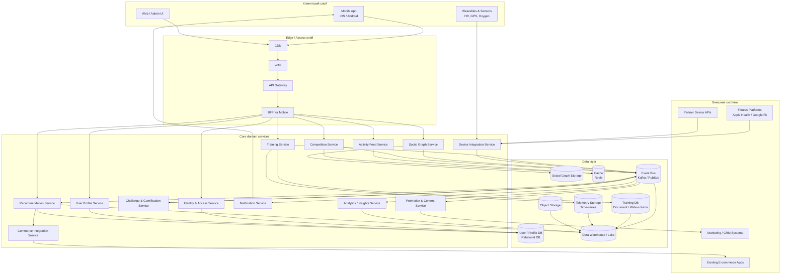
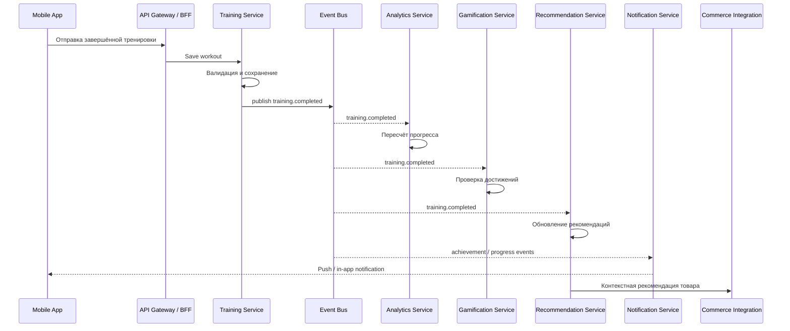

# Диаграмма архитектуры

## High-level architecture

## Основной поток: завершение тренировки

## Легенда

| Элемент | Назначение |
|---|---|
| API Gateway | Единая точка входа, маршрутизация, rate limiting |
| BFF | Адаптация API под мобильный клиент |
| Event Bus | Асинхронное взаимодействие сервисов |
| Training Service | Центральный сервис записи тренировок |
| Analytics Service | Расчёт прогресса и агрегатов |
| Recommendation Service | Персональные рекомендации тренировок, инвентаря и промо |
| Commerce Integration Service | Интеграция с существующими e-commerce приложениями |
| Data Warehouse | Аналитика, BI, ML и отчётность |
